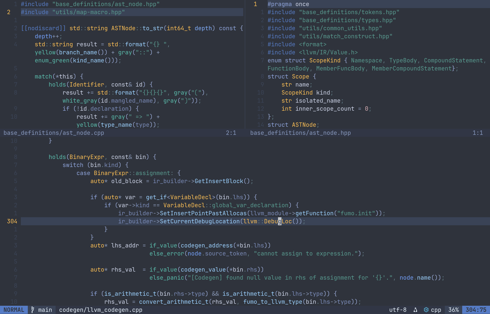

# space-mining.nvim

A soft dark colorscheme for Neovim.

## Preview



*Showcasing syntax highlighting for C++ code with the space-mining colorscheme*

## Installation

### lazy.nvim

```lua
{
  "riogu/space-mining.nvim",
  opts = {}
}
```

### packer.nvim

```lua
use {
  "riogu/space-mining.nvim",
  config = function()
    require("space-mining").setup()
  end,
}
```

### vim-plug

```vim
Plug 'riogu/space-mining.nvim'
```

Then in your `init.lua`:

```lua
require("space-mining").setup()
```

## Lualine

```lua
require("lualine").setup {
  options = {
    theme = require("space-mining").lualine_theme,
  },
}
```

## Requirements

- Neovim >= 0.8.0
- `termguicolors` enabled

## License

MIT
